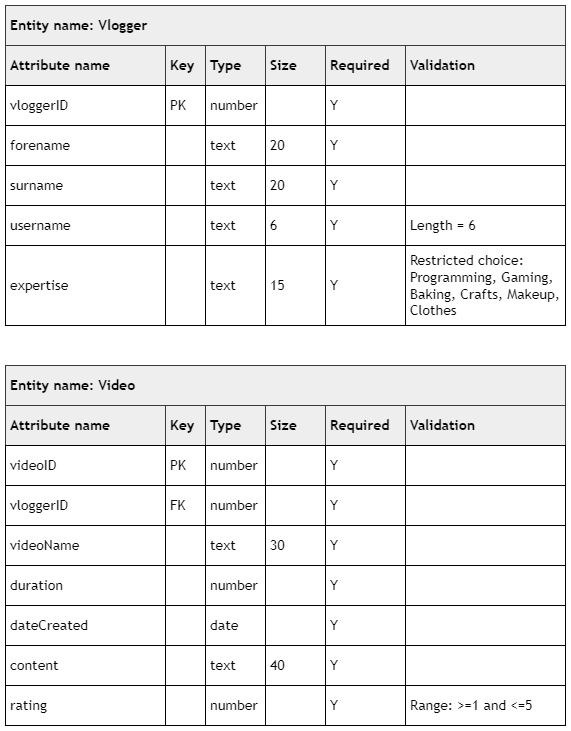

# N5 CS 2019 Task 1C

## Data dictionary

## Tasks

___1c(i)___ Mirren wants to advertise the best videos.

She wants to display the username and videoName of all videos with a rating greater than 3.

Implement the SQL statement that will output usernames and videoNames from the Vlogger and Video tables where the rating is greater than 3.

Print evidence of your SQL statement and the output from the query after it has been implemented. (__4 marks__)

___1c (ii)___ One of the videos called “Slime” contains a recipe for slime which does not work.
It should be removed from the database.

Implement the SQL statement that will delete the Slime video which has a videoID of 3.

Print evidence of your SQL statement and the Video table after the SQL statement has been implemented. (__2 marks__)